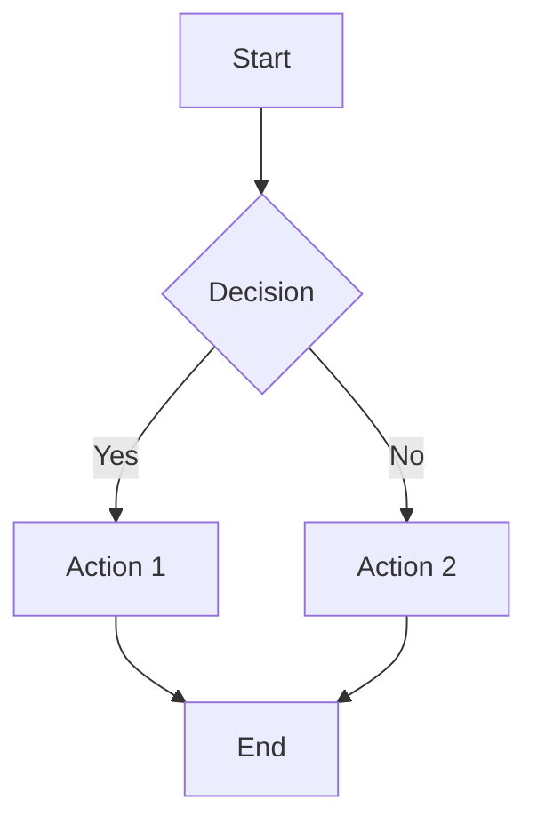
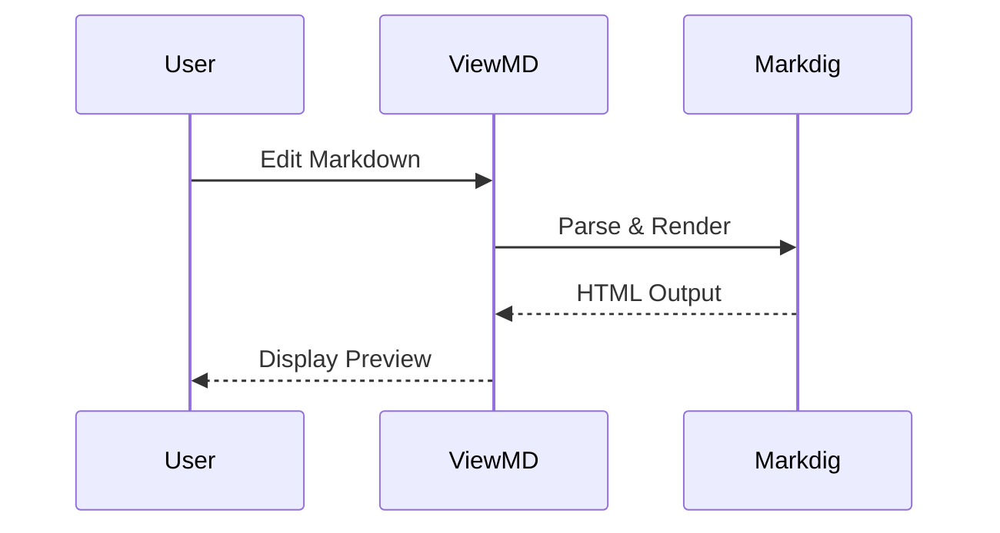

# Modern Markdown Features Test

This document tests all the newly enabled Markdown extensions in ViewMD.

## 1. Superscript and Subscript

### Superscript
- Mathematical notation: E = mc^2^
- Footnote references: See note^[1]^
- Ordinal numbers: 1^st^, 2^nd^, 3^rd^

### Subscript
- Chemical formulas: H~2~O, CO~2~, C~6~H~12~O~6~
- Mathematical indices: x~1~, x~2~, x~n~

## 2. Text Highlighting and Emphasis

### Mark/Highlight
This is ==highlighted text== that stands out from regular text.

You can ==highlight multiple words== to draw attention.

### Inserted Text
This text has ++inserted content++ shown with underline.

### Combined Emphasis
You can combine **bold**, *italic*, ==highlight==, ~~strikethrough~~, and ++inserted++ text.

## 3. Definition Lists

HTML
: Hypertext Markup Language, the standard language for creating web pages

CSS
: Cascading Style Sheets, used for styling HTML documents

JavaScript
: A programming language that enables interactive web pages

API
: Application Programming Interface

REST
: Representational State Transfer
: An architectural style for distributed systems

## 4. Figures with Captions


^^ Figure 1: The official Markdown logo

Images can now have proper captions using the figure syntax!

## 5. Custom Containers

::: note
This is a note container. It uses blue styling to indicate informational content.
:::

::: tip
This is a tip container with helpful advice! Look for the green border.
:::

::: important
This is important information that requires attention. Notice the purple styling.
:::

::: warning
This is a warning container. Exercise caution! Shows in yellow/orange.
:::

::: caution
This is a caution container for critical warnings. Displayed in red.
:::

## 6. Footnotes

Here's a sentence with a footnote reference[^1].

You can have multiple footnotes[^2] in your document.

Footnotes can be referenced multiple times[^1].

[^1]: This is the first footnote with detailed information.
[^2]: This is the second footnote. Footnotes appear at the bottom of the document.

## 7. Abbreviations

The HTML specification is maintained by the W3C.

You can use CSS to style your HTML documents.

The HTTP protocol is the foundation of the web.

*[HTML]: Hypertext Markup Language
*[CSS]: Cascading Style Sheets
*[W3C]: World Wide Web Consortium
*[HTTP]: Hypertext Transfer Protocol

## 8. Advanced Tables

| Feature | Status | Priority | Notes |
|:--------|:------:|:--------:|------:|
| Tables | ✅ | High | Fully supported |
| Diagrams | ✅ | High | Mermaid enabled |
| Math | ✅ | High | KaTeX support |
| Syntax | ⚠️ | Medium | Custom impl. |

## 9. Task Lists with Enhanced Styling

- [x] ✅ Enable UseEmphasisExtras()
- [x] ✅ Enable UseYamlFrontMatter()
- [x] ✅ Enable UseCustomContainers()
- [x] ✅ Enable UseFigures()
- [x] ✅ Add CSS styling
- [x] ✅ Test dark theme
- [ ] ❌ Add more features

## 10. Mathematical Expressions

Inline math: $E = mc^2$

Display math:

$$
\frac{-b \pm \sqrt{b^2 - 4ac}}{2a}
$$

Chemical equation: $\ce{H2O}$

Matrix:

$$
\begin{bmatrix}
a & b \\
c & d
\end{bmatrix}
$$

## 11. Mermaid Diagrams





## 12. Code with Syntax Highlighting

### C# Code
```csharp
public class MarkdownService : IMarkdownService
{
    private readonly MarkdownPipeline _pipeline;

    public string RenderToHtml(string markdown)
    {
        return Markdown.ToHtml(markdown, _pipeline);
    }
}
```

### Python Code
```python
def fibonacci(n):
    if n <= 1:
        return n
    return fibonacci(n-1) + fibonacci(n-2)

# Calculate 10th Fibonacci number
result = fibonacci(10)
print(f"Result: {result}")
```

### JavaScript Code
```javascript
const processMarkdown = async (text) => {
    const html = await renderMarkdown(text);
    return {
        html,
        success: true,
        timestamp: Date.now()
    };
};
```

## 13. Blockquotes with Nested Content

> This is a blockquote with **bold text** and *italics*.
>
> > This is a nested blockquote.
> > It can contain multiple paragraphs.
>
> Back to the first level with `inline code`.

## 14. Combination Test

Here's a complex example combining multiple features:

The ==H~2~O== molecule^[3]^ is essential for life. According to the W3C, proper HTML structure is ++critically important++.

::: tip
**Pro Tip**: You can combine ==highlighting==, super^script^, and sub~script~ in the same paragraph!
:::

### Complex Table with Formulas

| Formula | Description | Result |
|:--------|:------------|-------:|
| $a^2 + b^2 = c^2$ | Pythagorean theorem | $c = \sqrt{a^2 + b^2}$ |
| $E = mc^2$ | Mass-energy equivalence | Energy |
| $F = ma$ | Newton's second law | Force |

[^3]: Water - the universal solvent

## Summary

✅ All modern Markdown features are now enabled in ViewMD:
- Superscript (x^2^) and Subscript (H~2~O)
- ==Highlighting== and ++inserted text++
- Definition lists
- Figures with captions
- Custom containers (note, tip, warning, etc.)
- Enhanced footnotes and abbreviations
- YAML front matter metadata
- Full mathematical typesetting
- Mermaid diagrams
- Advanced syntax highlighting

**ViewMD is now feature-complete with modern Markdown standards! 🎉**
